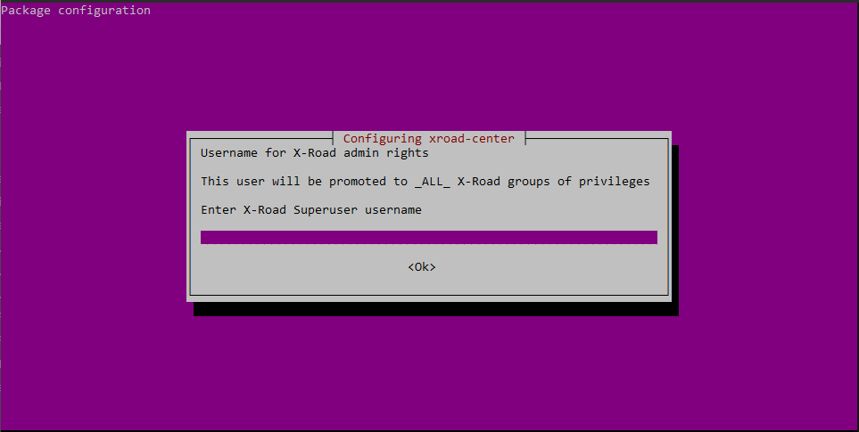
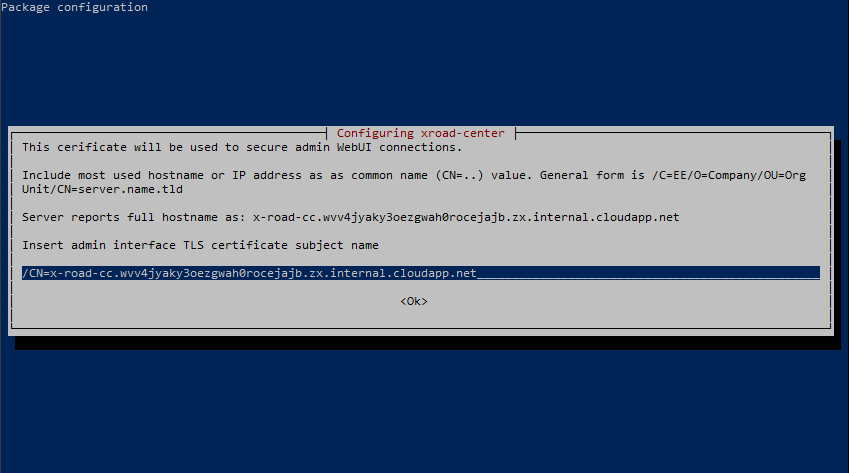
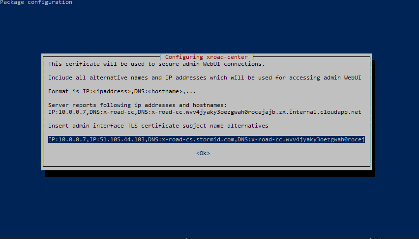
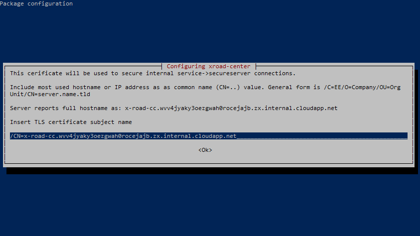
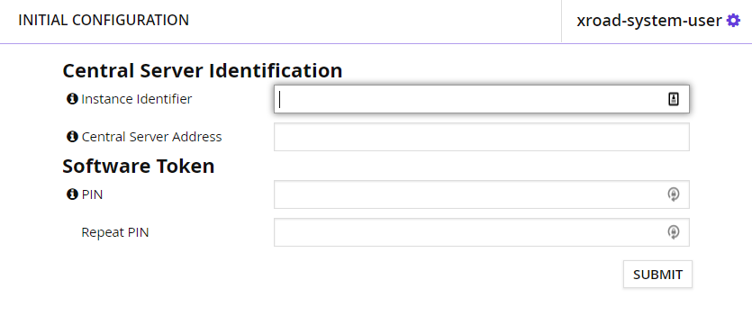
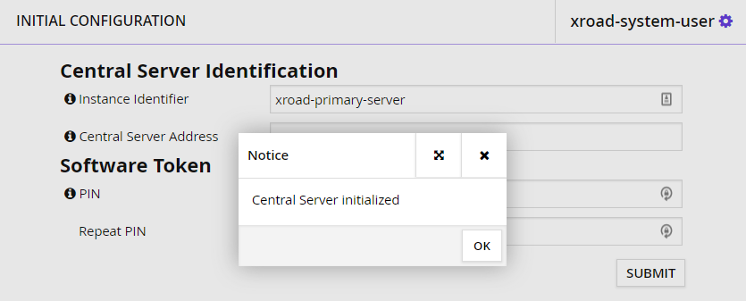

# X-Road Central Server Installation (Manual)

This guide is intended to provide a proof of concept setup for an X-Road Central Server using the Microsoft Azure platform. Following these steps will deploy a B1 Standard Virtual Machine instance running Ubuntu 18.04-LTS with required ports opened, install and configure ansible, set up the required users and groups, and install and configure the X-Road Central Server.

>  ***NB:*** Any services intended for X-Road are not allowed to talk to the central server directly. The central server requires a security server to acts as a proxy, as well as ensure the integrity and authenticity of data, while encrypting or decrypting data while in transit. The security server should exist on the same internal network with central server.

[TODO] For automated installation, see [readme-arm.md](readme-arm.md)

---

# Steps


## 1) Set up Resource Group in Azure

> ### Example
>
> ```shell
> x-road-rnd
> ```


## 2) Deploy Virtual Machine with Ansible installation script

> ### Template
>
> ```json
> {
>     "$schema": "http://schema.management.azure.com/schemas/2015-01-01/deploymentTemplate.json#",
>     "contentVersion": "1.0.0.0",
>     "parameters": {
>         "location": {
>             "defaultValue": "[resourceGroup().location]",
>             "type": "String",
>             "metadata": {
>                 "description": "Location for all resources."
>             }
>         },
>         "virtualMachineName": {
>             "type": "String"
>         },
>         "virtualMachineSize": {
>             "defaultValue": "Standard_DS1_v2",
>             "allowedValues": [
>                 "Standard_B1ms",
>                 "Standard_B1s",
>                 "Standard_B2s",
>                 "Standard_DS1_v2"
>             ],
>             "type": "String"
>         },
>         "adminUsername": {
>             "type": "String"
>         },
>         "adminPassword": {
>             "type": "SecureString"
>         }
>     },
>     "variables": {
>         "nsgId": "[resourceId(resourceGroup().name, 'Microsoft.Network/networkSecurityGroups', variables('networkSecurityGroupName'))]",
>         "vnetId": "[resourceId(resourceGroup().name,'Microsoft.Network/virtualNetworks', variables('virtualNetworkName'))]",
>         "subnetRef": "[concat(variables('vnetId'), '/subnets/', variables('subnetName'))]",
>         "networkInterfaceName": "ansibleVMnic",
>         "networkSecurityGroupName": "ansible-nsg",
>         "subnetName": "default",
>         "virtualNetworkName": "ansible-vnet",
>         "publicIpAddressName": "ansible-ip",
>         "publicIpAddressType": "Dynamic",
>         "publicIpAddressSku": "Basic",
>         "publicIPRef": "[resourceId('Microsoft.Network/publicIPAddresses',variables('publicIPAddressName'))]",
>         "osDiskType": "Premium_LRS"
>     },
>     "resources": [
>         {
>             "type": "Microsoft.Network/networkInterfaces",
>             "apiVersion": "2018-04-01",
>             "name": "[variables('networkInterfaceName')]",
>             "location": "[parameters('location')]",
>             "dependsOn": [
>                 "[concat('Microsoft.Network/networkSecurityGroups/', variables('networkSecurityGroupName'))]",
>                 "[concat('Microsoft.Network/virtualNetworks/', variables('virtualNetworkName'))]",
>                 "[concat('Microsoft.Network/publicIpAddresses/', variables('publicIpAddressName'))]"
>             ],
>             "tags": {},
>             "properties": {
>                 "ipConfigurations": [
>                     {
>                         "name": "ipconfig1",
>                         "properties": {
>                             "subnet": {
>                                 "id": "[variables('subnetRef')]"
>                             },
>                             "privateIPAllocationMethod": "Dynamic",
>                             "publicIpAddress": {
>                                 "id": "[resourceId(resourceGroup().name, 'Microsoft.Network/publicIpAddresses', variables('publicIpAddressName'))]"
>                             }
>                         }
>                     }
>                 ],
>                 "networkSecurityGroup": {
>                     "id": "[variables('nsgId')]"
>                 }
>             }
>         },
>         {
>             "type": "Microsoft.Network/networkSecurityGroups",
>             "apiVersion": "2018-08-01",
>             "name": "[variables('networkSecurityGroupName')]",
>             "location": "[parameters('location')]",
>             "tags": {},
>             "properties": {
>                 "securityRules": [
>                     {
>                         "name": "SSH",
>                         "properties": {
>                             "priority": 300,
>                             "protocol": "TCP",
>                             "access": "Allow",
>                             "direction": "Inbound",
>                             "sourceAddressPrefix": "*",
>                             "sourcePortRange": "*",
>                             "destinationAddressPrefix": "*",
>                             "destinationPortRange": "22"
>                         }
>                     },
>                     {
>                         "name": "AuthCertRegistration",
>                         "properties": {
>                             "priority": 301,
>                             "protocol": "TCP",
>                             "access": "Allow",
>                             "direction": "Inbound",
>                             "sourceAddressPrefix": "*",
>                             "sourcePortRange": "*",
>                             "destinationAddressPrefix": "*",
>                             "destinationPortRange": "4001"
>                         }
>                     },
>                     {
>                         "name": "SoftwareUpdates",
>                         "properties": {
>                             "priority": 302,
>                             "protocol": "TCP",
>                             "access": "Allow",
>                             "direction": "Outbound",
>                             "sourceAddressPrefix": "*",
>                             "sourcePortRange": "*",
>                             "destinationAddressPrefix": "*",
>                             "destinationPortRange": "80"
>                         }
>                     },
>                     {
>                         "name": "InternalNetworkPort",
>                         "properties": {
>                             "priority": 303,
>                             "protocol": "TCP",
>                             "access": "Allow",
>                             "direction": "Inbound",
>                             "sourceAddressPrefix": "*",
>                             "sourcePortRange": "*",
>                             "destinationAddressPrefix": "*",
>                             "destinationPortRange": "80"
>                         }
>                     },
>                     {
>                         "name": "InternalUIPort",
>                         "properties": {
>                             "priority": 304,
>                             "protocol": "TCP",
>                             "access": "Allow",
>                             "direction": "Outbound",
>                             "sourceAddressPrefix": "*",
>                             "sourcePortRange": "*",
>                             "destinationAddressPrefix": "*",
>                             "destinationPortRange": "4000"
>                         }
>                     },
>                     {
>                         "name": "InternalMgmgServicePortHttps",
>                         "properties": {
>                             "priority": 305,
>                             "protocol": "TCP",
>                             "access": "Allow",
>                             "direction": "Outbound",
>                             "sourceAddressPrefix": "*",
>                             "sourcePortRange": "*",
>                             "destinationAddressPrefix": "*",
>                             "destinationPortRange": "4001"
>                         }
>                     },
>                     {
>                         "name": "InternalMgmgServicePortHttp",
>                         "properties": {
>                             "priority": 305,
>                             "protocol": "TCP",
>                             "access": "Allow",
>                             "direction": "Inbound",
>                             "sourceAddressPrefix": "*",
>                             "sourcePortRange": "*",
>                             "destinationAddressPrefix": "*",
>                             "destinationPortRange": "4400"
>                         }
>                     }
> 
>                 ]
>             }
>         },
>         {
>             "type": "Microsoft.Network/virtualNetworks",
>             "apiVersion": "2018-08-01",
>             "name": "[variables('virtualNetworkName')]",
>             "location": "[parameters('location')]",
>             "tags": {},
>             "properties": {
>                 "addressSpace": {
>                     "addressPrefixes": [
>                         "10.0.0.0/24"
>                     ]
>                 },
>                 "subnets": [
>                     {
>                         "name": "default",
>                         "properties": {
>                             "addressPrefix": "10.0.0.0/24"
>                         }
>                     }
>                 ]
>             }
>         },
>         {
>             "type": "Microsoft.Network/publicIpAddresses",
>             "apiVersion": "2018-08-01",
>             "name": "[variables('publicIpAddressName')]",
>             "location": "[parameters('location')]",
>             "tags": {},
>             "sku": {
>                 "name": "[variables('publicIpAddressSku')]"
>             },
>             "properties": {
>                 "publicIpAllocationMethod": "[variables('publicIpAddressType')]"
>             }
>         },
>         {
>             "type": "Microsoft.Compute/virtualMachines",
>             "apiVersion": "2018-06-01",
>             "name": "[parameters('virtualMachineName')]",
>             "location": "[parameters('location')]",
>             "dependsOn": [
>                 "[concat('Microsoft.Network/networkInterfaces/', variables('networkInterfaceName'))]"
>             ],
>             "tags": {},
>             "properties": {
>                 "hardwareProfile": {
>                     "vmSize": "[parameters('virtualMachineSize')]"
>                 },
>                 "storageProfile": {
>                     "osDisk": {
>                         "createOption": "FromImage",
>                         "managedDisk": {
>                             "storageAccountType": "[variables('osDiskType')]"
>                         }
>                     },
>                     "imageReference": {
>                         "publisher": "Canonical",
>                         "offer": "UbuntuServer",
>                         "sku": "18.04-LTS",
>                         "version": "latest"
>                     }
>                 },
>                 "networkProfile": {
>                     "networkInterfaces": [
>                         {
>                             "id": "[resourceId('Microsoft.Network/networkInterfaces', variables('networkInterfaceName'))]"
>                         }
>                     ]
>                 },
>                 "osProfile": {
>                     "computerName": "[parameters('virtualMachineName')]",
>                     "adminUsername": "[parameters('adminUsername')]",
>                     "adminPassword": "[parameters('adminPassword')]"
>                 }
>             }
>         },
>         {
>             "name": "[concat(parameters('virtualMachineName'),'/CustomScript')]",
>             "type": "Microsoft.Compute/virtualMachines/extensions",
>             "location": "[parameters('location')]",
>             "apiVersion": "2015-06-15",
>             "dependsOn": [
>                 "[concat('Microsoft.Compute/virtualMachines/', parameters('virtualMachineName'))]",
>                 "[concat('Microsoft.Network/publicIpAddresses/', variables('publicIpAddressName'))]"
>             ],
>             "properties": {
>                 "publisher": "Microsoft.Azure.Extensions",
>                 "type": "CustomScript",
>                 "typeHandlerVersion": "2.0",
>                 "autoUpgradeMinorVersion": true,
>                 "settings": {
>                     "fileUris": [
>                         "https://raw.githubusercontent.com/Microsoft/azuredevopslabs/master/labs/vstsextend/ansible/armtemplate/install_ansible.sh"
>                     ]
>                 },
>                 "protectedSettings" : {"commandToExecute": "sh install_ansible.sh"}
>             }
>         }
>     ],
>     "outputs": {
>         "adminUsername": {
>             "type": "string",
>             "value": "[parameters('adminUsername')]"
>         },
>         "publicIpAddress" : {
>             "type": "string",
>             "value": "[reference(variables('publicIPRef')).ipAddress]"
>         }
>     }
> }
> ```

> ### Template parameters
>
> ```json
> {
>     "$schema": "https://schema.management.azure.com/schemas/2015-01-01/deploymentParameters.json#",
>     "contentVersion": "1.0.0.0",
>     "parameters": {
>       "location": {
>         "value": "[resourceGroup().location]"
>       },
>       "virtualMachineName": {
>         "value": "x-road-cs"
>       },
>       "virtualMachineSize": {
>         "value": "Standard_B1s"
>       },
>       "adminUsername": {
>         "value": "<your admin username here>"
>       },
>       "adminPassword": {
>         "value": "<your admin password here>"
>       }
>     }
>   }
> ```


## 3) Take note of the administrator credentials

Public IP address should be shared with the X-Road Security Server administrator. Ideally, it should be a static address (configured in ARM template). For this example, we're using a dynamic IP. Ideally, all passwords should be secured in the deployment environment and only known to the server administrator.
> ### Public IP can be found in the  _Deployment Output_ *Blade*.
>
> | Variable          | Value                           |
> | ----------------- | ------------------------------- |
> | `adminUsername`   | `<your admin username here>`    |
> | `publicIpAddress` | `<virtual machine's public IP>` |
> | `adminPassword`   | `<your admin password here>`    |


## 4) Log into virtual machine

Either log in using a public key or password. This guide is using a password.

> ### Connecting to central server from command line or shell
>
> ```shell
> $ ssh {adminUsername}@{publicIpAddress}
> ```

> ### Example
>
> ```sh
> $ ssh admin@192.168.0.1
> ```

First login will warn that the authenticity of the public IP host can't be established and displays the ECDSA key fingerprint. 

1. Type `yes` into the prompt.
2. Type in your `adminPassword` as configured in ARM template parameters file.


## 5) Add a system user and grant all user interface role groups

X-Road uses predefined user groups for its primary servers. This guide prepares users and groups prior to installation to keep related actions in the same place. Since the installation script will automatically create the groups if they're missing (but does not assign them to groups), you can choose to only create the user account and leave group assignments until after the installation is complete.

> ### Creating the required groups for x-road:
>
> ```bash
> admin@x-road-cs:~$ sudo groupadd xroad-registration-officer
> admin@x-road-cs:~$ sudo groupadd xroad-system-administrator
> admin@x-road-cs:~$ sudo groupadd xroad-security-officer
> ```

> ### Creating the system user and assigning it the required groups
>
> ```bash
> admin@x-road-cs:~$ sudo adduser --system xroad-system-user
> Adding system user `xroad-system-user' (UID 111) ...
> Adding new user `xroad-system-user' (UID 111) with group `nogroup' ...
> Creating home directory `/home/xroad-system-user' ...
> 
> admin@x-road-cs:~$ sudo adduser xroad-system-user xroad-registration-officer
> Adding user `xroad-system-user' to group `xroad-registration-officer' ...
> Adding user xroad-system-user to group xroad-registration-officer
> Done.
> 
> admin@x-road-cs:~$ sudo adduser xroad-system-user xroad-system-administrator
> Adding user `xroad-system-user' to group `xroad-system-administrator' ...
> Adding user xroad-system-user to group xroad-system-administrator
> Done.
> 
> admin@x-road-cs:~$ sudo adduser xroad-system-user xroad-security-officer
> Adding user `xroad-system-user' to group `xroad-security-officer' ...
> Adding user xroad-system-user to group xroad-security-officer
> Done.
> 
> admin@x-road-cs:~$ sudo passwd xroad-system-user
> admin@x-road-cs:~$ Enter new UNIX password: {xroad-system-user-password}
> admin@x-road-cs:~$ Retype new UNIX password: {xroad-system-user-password}
> passwd: password updated successfully
> ```


## 6) Add UTF8 for en-US  locale to the environment

> ### Append a line to /etc/environment and generate the locale
>
> ```bash
> admin@x-road-cs:~$ sudo bash -c 'echo "LC_ALL=en_US.UTF-8" >> /etc/environment'
> admin@x-road-cs:~$ sudo locale-gen en_US.UTF-8
> Generating locales (this might take a while)...
>   en_US.UTF-8... done
> Generation complete.
> ```


## 7) Prepare the package manager

The installation is mostly automated once the script is executed. Configuration will require manual intervention.

> ```sh
> admin@x-road-cs:~$ curl https://artifactory.niis.org/api/gpg/key/public | sudo apt-key add -
>   % Total    % Received % Xferd  Average Speed   Time    Time     Time  Current
>                                  Dload  Upload   Total   Spent    Left  Speed
> 100   989    0   989    0     0   4848      0 --:--:-- --:--:-- --:--:--  4848
> OK
> 
> admin@x-road-cs:~$ sudo apt-add-repository -y "deb https://artifactory.niis.org/xroad-release-deb $(lsb_release -sc)-current main"
> Get:1 http://security.ubuntu.com/ubuntu bionic-security InRelease [88.7 kB]
> Hit:2 http://azure.archive.ubuntu.com/ubuntu bionic InRelease
> Get:3 http://azure.archive.ubuntu.com/ubuntu bionic-updates InRelease [88.7 kB]
> Get:4 http://azure.archive.ubuntu.com/ubuntu bionic-backports InRelease [74.6 kB]
> Ign:5 https://artifactory.niis.org/xroad-release-deb bionic-current InRelease
> Get:6 https://artifactory.niis.org/xroad-release-deb bionic-current Release [1,885 B]
> Get:7 https://artifactory.niis.org/xroad-release-deb bionic-current Release.gpg [475 B]
> Get:8 https://artifactory.niis.org/xroad-release-deb bionic-current/main amd64 Packages [8,710 B]
> Fetched 263 kB in 1s (498 kB/s)
> Reading package lists... Done
> 
> admin@x-road-cs:~$ sudo apt-add-repository -y ppa:openjdk-r/ppa
> Hit:1 http://security.ubuntu.com/ubuntu bionic-security InRelease
> Get:2 http://ppa.launchpad.net/openjdk-r/ppa/ubuntu bionic InRelease [15.4 kB]
> Hit:3 http://azure.archive.ubuntu.com/ubuntu bionic InRelease
> Get:4 http://azure.archive.ubuntu.com/ubuntu bionic-updates InRelease [88.7 kB]
> Get:5 http://azure.archive.ubuntu.com/ubuntu bionic-backports InRelease [74.6 kB]
> Ign:6 https://artifactory.niis.org/xroad-release-deb bionic-current InRelease
> Get:7 http://ppa.launchpad.net/openjdk-r/ppa/ubuntu bionic/main amd64 Packages [7,060 B]
> Hit:8 https://artifactory.niis.org/xroad-release-deb bionic-current Release
> Get:9 http://ppa.launchpad.net/openjdk-r/ppa/ubuntu bionic/main Translation-en [1,380 B]
> Fetched 187 kB in 1s (339 kB/s)
> Reading package lists... Done
> 
> admin@x-road-cs:~$ sudo apt-add-repository -y ppa:nginx/stable
> Get:1 http://ppa.launchpad.net/nginx/stable/ubuntu bionic InRelease [15.4 kB]
> Hit:2 http://security.ubuntu.com/ubuntu bionic-security InRelease
> Hit:3 http://ppa.launchpad.net/openjdk-r/ppa/ubuntu bionic InRelease
> Hit:4 http://azure.archive.ubuntu.com/ubuntu bionic InRelease
> Get:5 http://azure.archive.ubuntu.com/ubuntu bionic-updates InRelease [88.7 kB]
> Get:6 http://azure.archive.ubuntu.com/ubuntu bionic-backports InRelease [74.6 kB]
> Get:7 http://ppa.launchpad.net/nginx/stable/ubuntu bionic/main amd64 Packages [4,292 B]
> Get:8 http://ppa.launchpad.net/nginx/stable/ubuntu bionic/main Translation-en [4,324 B]
> Ign:9 https://artifactory.niis.org/xroad-release-deb bionic-current InRelease
> Hit:10 https://artifactory.niis.org/xroad-release-deb bionic-current Release
> Fetched 187 kB in 1s (306 kB/s)
> Reading package lists... Done
> 
> admin@x-road-cs:~$ sudo apt-get update
> Hit:1 http://ppa.launchpad.net/nginx/stable/ubuntu bionic InRelease
> Hit:2 http://security.ubuntu.com/ubuntu bionic-security InRelease
> Hit:3 http://ppa.launchpad.net/openjdk-r/ppa/ubuntu bionic InRelease
> Hit:4 http://azure.archive.ubuntu.com/ubuntu bionic InRelease
> Get:5 http://azure.archive.ubuntu.com/ubuntu bionic-updates InRelease [88.7 kB]
> Get:6 http://azure.archive.ubuntu.com/ubuntu bionic-backports InRelease [74.6 kB]
> Ign:7 https://artifactory.niis.org/xroad-release-deb bionic-current InRelease
> Hit:8 https://artifactory.niis.org/xroad-release-deb bionic-current Release
> Fetched 163 kB in 1s (257 kB/s)
> Reading package lists... Done
> 
> admin@x-road-cs:~$ sudo apt-get install xroad-centralserver
> Reading package lists... Done
> Building dependency tree
> Reading state information... Done
> The following additional packages will be installed:
>   ca-certificates-java crudini fontconfig-config fonts-dejavu-core java-common libfontconfig1 libjpeg-turbo8 libjpeg8
>   liblcms2-2 libmhash2 libnginx-mod-http-echo libnspr4 libnss3 libpcsclite1 libpq5 libsensors4 libxi6 libxrender1
>   libxtst6 nginx-common nginx-light openjdk-8-jre-headless postgresql postgresql-10 postgresql-client-10
>   postgresql-client-common postgresql-common postgresql-contrib python-iniparse rlwrap ssl-cert sysstat unzip
>   x11-common xroad-base xroad-center xroad-centralserver-monitoring xroad-confclient xroad-jetty9 xroad-nginx
>   xroad-signer
> Suggested packages:
>   default-jre liblcms2-utils pcscd lm-sensors fcgiwrap nginx-doc libnss-mdns fonts-dejavu-extra fonts-ipafont-gothic
>   fonts-ipafont-mincho fonts-wqy-microhei fonts-wqy-zenhei fonts-indic postgresql-doc locales-all postgresql-doc-10
>   libjson-perl openssl-blacklist isag zip
> The following NEW packages will be installed:
>   ca-certificates-java crudini fontconfig-config fonts-dejavu-core java-common libfontconfig1 libjpeg-turbo8 libjpeg8
>   liblcms2-2 libmhash2 libnginx-mod-http-echo libnspr4 libnss3 libpcsclite1 libpq5 libsensors4 libxi6 libxrender1
>   libxtst6 nginx-common nginx-light openjdk-8-jre-headless postgresql postgresql-10 postgresql-client-10
>   postgresql-client-common postgresql-common postgresql-contrib python-iniparse rlwrap ssl-cert sysstat unzip
>   x11-common xroad-base xroad-center xroad-centralserver xroad-centralserver-monitoring xroad-confclient xroad-jetty9
>   xroad-nginx xroad-signer
> 0 upgraded, 42 newly installed, 0 to remove and 0 not upgraded.
> Need to get 307 MB of archives.
> After this operation, 422 MB of additional disk space will be used.
> Do you want to continue? [Y/n] 
> ```
Press  `Y` to proceed with installation. The script will ask for the system superuser username (`xroad-system-user`)



The script will proceed with the installation, and will then ask for details for the certificate.



> ### Example
>
> ```
> /C=GB/O=Storm id/OU=R&D/CN=x-road-cs.uksouth.cloudapp.azure.com
> ```

The script will also ask for subject name alternatives



It also asks for a name for securing internal connections



> ### Example
>
> ```
> /C=GB/O=Storm id/OU=R&D/CN=x-road-cs.uksouth.cloudapp.azure.com
> ```

And as previous, prompts for subject name alternatives.

The script will then proceed to create a postgresql database and apply necessary migrations.

## 8) Install support for hardware tokens

```shell
admin@x-road-cs:~$ sudo apt-get install xroad-addon-hwtokens
admin@x-road-cs:~$ sudo service xroad-signer restart
```

## 9) Perform post-installation checks

```shell
admin@x-road-cs:~$ sudo systemctl list-units "xroad*"
```

## 10) Test that the central server administration interface can be opened

A temporary inbound port may be needed to be added in the Azure Network Security Group

```
https://central-server-address:4000
```

## 11) Configure the Central Server

Log in using the credentials created earlier

* Username: `xroad-system-user`
* Password: `<your admin password here>`

The central server will prompt for initial configuration:



* Instance Identifier: `xroad-primary-server`
* Central Server Address: `51.105.44.103`
* Software Token PIN: `5313`

A notice will be displayed that central server is initialized



